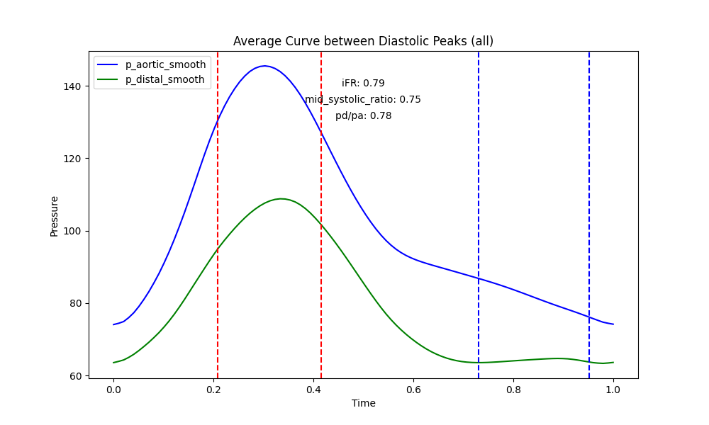

# pressure_curve_processing
## Abstract
This code analysis invasively measured curves in the setting of anomalous aortic origin of a coronary artery (AAOCA). Specifically, it identifies the point of aortic valve closer and then calculates instanstaneous wave-free ratio, mid-systolic pressure ratio and the integral of systolic phase and diastolic phase for the Pa curve and Pd curve and their difference.
The analysis is automatically performed for all tests performed (during rest with Pd/Pa, $FFR_Adenosine$ and $FFR_Dobutamine$ during dobutamine-atropine-volume challenge).
Additionally, for Pressure measurementes over a long period of time (i.e. $FFR_Adenosine$ and $FFR_Dobutamine$) additional analysis for the 25th percentile and 75th percentile of Pd/Pa Values are performed.
Lastly, the code produces averaged pressure curves are created for Pa and Pd for all phases over recording period and again 25th and 75th percentile.

## Installation

```shell
    python -m venv env
    env\Scripts\activate.bat
    pip install poetry
    poetry install
```

## Expected Input

The analysis expects a dataframe in the following format, derived from invasive Fractional Flow Reserve (FFR) measurements:
```
|    | time | p_aortic | p_mean_aortic | p_distal | p_mean_distal | pd/pa | n/a | peaks |
|----|------|----------|---------------|----------|---------------|-------|-----|-------|
| 0  | 0.01 | 83.0     | 80.7          | 81.4     | 82.0          | 1.016 | 7.1 | 0     |
| 1  | 0.02 | 85.7     | 80.7          | 83.1     | 82.0          | 1.016 | 7.1 | 0     |
| 2  | 0.03 | 88.0     | 80.8          | 85.0     | 82.0          | 1.015 | 7.1 | 0     |
| 3  | 0.04 | 89.6     | 80.8          | 87.3     | 82.0          | 1.015 | 7.1 | 0     |
...
```
Required columns are `time`, `p_aortic`, `p_distal`, `pd/pa` and `peak`

To acquire this data we used RadiView files, on which run a first peak detection with SciPy's `find_peaks` function (Code will be provided in the future).

To run the analysis a folder with the following tree structure is expected:
```
.
├── NARCO_10_eval
│   ├── analysis_narco_10_pressure_.csv
│   ├── narco_10_pressure_ade.csv
│   ├── narco_10_pressure_dobu.csv
│   └── narco_10_pressure_rest_1.csv
├── NARCO_119_eval
│   ├── analysis_narco_119_pressure_.csv
│   ├── narco_119_pressure_ade.csv
│   └── narco_119_pressure_dobu.csv
├── NARCO_122_eval
│   ├── analysis_narco_122_pressure_.csv
│   ├── narco_122_pressure_ade.csv
│   ├── narco_122_pressure_dobu.csv
│   ├── narco_122_pressure_dobu.png
│   ├── narco_122_pressure_rest_1.csv
│   └── narco_122_pressure_rest_1.png
│   
...
```
Note: really required are only files ending with _ade.csv, _dobu.csv, and rest_1.csv. But other files automatically are ignored.

## Analysis performed


## Output
```
.
├── NARCO_10_eval
│   ├── narco_10_pressure_ade.csv
│   ├── narco_10_pressure_ade_average_curve_all.csv
│   ├── narco_10_pressure_ade_average_curve_all.png
│   ├── narco_10_pressure_ade_average_curve_high.csv
│   ├── narco_10_pressure_ade_average_curve_high.png
│   ├── narco_10_pressure_ade_average_curve_low.csv
│   ├── narco_10_pressure_ade_average_curve_low.png
│   ├── narco_10_pressure_ade_pdpa_iFR_midsystolic_over_time.png
│   ├── narco_10_pressure_dobu.csv
│   ├── narco_10_pressure_dobu_average_curve_all.csv
│   ├── narco_10_pressure_dobu_average_curve_all.png
│   ├── narco_10_pressure_dobu_average_curve_high.csv
│   ├── narco_10_pressure_dobu_average_curve_high.png
│   ├── narco_10_pressure_dobu_average_curve_low.csv
│   ├── narco_10_pressure_dobu_average_curve_low.png
│   ├── narco_10_pressure_dobu_pdpa_iFR_midsystolic_over_time.png
│   ├── narco_10_pressure_rest_1.csv
│   ├── narco_10_pressure_rest_1_average_curve_all.csv
│   ├── narco_10_pressure_rest_1_average_curve_all.png
│   ├── narco_10_pressure_rest_1_average_curve_high.csv
│   ├── narco_10_pressure_rest_1_average_curve_high.png
│   ├── narco_10_pressure_rest_1_average_curve_low.csv
│   ├── narco_10_pressure_rest_1_average_curve_low.png
│   └── narco_10_pressure_rest_1_pdpa_iFR_midsystolic_over_time.png
├── NARCO_119_eval
│   ├── narco_119_pressure_ade.csv
│   ├── narco_119_pressure_ade_average_curve_all.csv
...
```